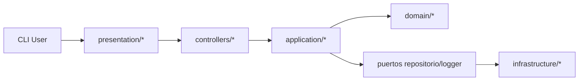

# Arquitectura (MVC por capas)

`Trabajo_final_v2` mantiene la UX de consola del baseline, pero reubica la lógica:

- `presentation/`: menús CLI, validación de entrada (tipo “UI”) e impresión.
- `controllers/`: orquestan entrada -> DTOs -> casos de uso (application).
- `application/`: servicios/casos de uso con reglas de negocio (stock, estados, prerequisitos).
- `domain/`: entidades, enums y DTOs (modelo explícito).
- `infrastructure/`: adaptadores de persistencia JSON/TXT + logger + wiring (`factory.py`).

Diagrama (alto nivel):

